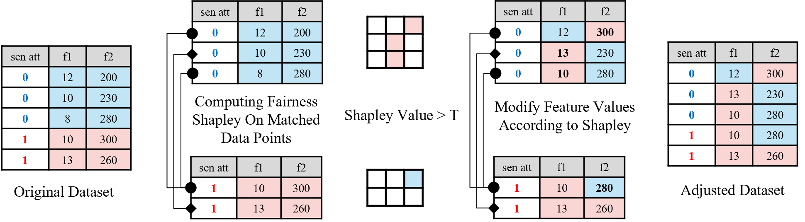

# FairSHAP: Preprocessing for Fairness Through Attribution-Based Data Augmentation

[](https://arxiv.org/pdf/2505.11111)
[](https://opensource.org/licenses/MIT)

Official implementation of the paper "FairSHAP: Preprocessing for Fairness Through Attribution-Based Data Augmentation".

## Overview

Ensuring fairness in machine learning models is critical, particularly in high-stakes domains where biased decisions can lead to serious societal consequences. However, existing preprocessing approaches generally lack transparent mechanisms for identifying which features are responsible for unfairness. This obscures the rationale behind data modifications.

We introduce **FairSHAP**, a novel preprocessing framework that leverages Shapley value attribution to improve both individual and group fairness. FairSHAP identifies fairness-critical features in the training data using an interpretable measure of feature importance, and systematically modifies them through instance-level matching across sensitive groups. Our method effectively reduces discriminative risk (DR) with solid theoretical guarantees subject to a bounded interaction residual, while simultaneously bounding the upper limit of demographic parity (DP), which in practice leads to its reduction. Experiments on multiple tabular datasets show that we achieve state-of-the-art or comparable performance across DR, DP, and equality of opportunity (EO) with minimal modifications, thereby preserving data fidelity. As a model-agnostic and transparent method, FairSHAP integrates seamlessly into existing machine learning pipelines and provides actionable insights into the sources of bias.

## Framework



FairSHAP consists of two interconnected components working together to identify and mitigate bias in training data:

### Component 1: Group Division and Matching (Left Side)

The process begins by dividing the training set into two groups—**privileged group** and **unprivileged group**—based on the sensitive attribute (e.g., gender, race). To ensure a precise mapping relationship between the two groups, a **nearest neighbor matching procedure** is applied. This step aligns instances from one group with similar instances in the other group, creating matched pairs that facilitate a more equitable analysis. This alignment is visually emphasized in the left portion of the figure, highlighting the pairing process.

### Component 2: Bias Mitigation Through Bidirectional Learning (Right Side)

The focus shifts to leveraging these matched pairs for bias mitigation:

1. **Shapley Value Computation**: One group is selected as the target group, while the other serves as the reference data for computing Shapley values for instances within the target group.

2. **Feature Identification**: These Shapley values are combined with discriminative risk (DR) to identify specific feature values that contribute to fairness disparities.

3. **Feature Modification**: Once identified, these feature values are modified to reduce DR.

4. **Bidirectional Process**: The process is repeated with the roles of the two groups reversed, ensuring that each group can effectively learn useful feature values from the other. This bidirectional learning approach helps to capture a more balanced and comprehensive representation of the data.

5. **Data Augmentation**: Finally, the modified instances from both groups are combined to form an augmented training set, which is designed to reduce biases and improve fairness.

## Key Features

- **Multiple Fairness Metrics**: Supports Discrimination Risk (DR), Demographic Parity (DP), Equal Opportunity (EO), and Predictive Quality Parity (PQP)
- **Flexible Matching Methods**: Nearest Neighbor (NN) and Optimal Transport (OT) based matching
- **Multiple Datasets**: Pre-configured for 6 real-world datasets including German Credit, Adult, COMPAS, and Census Income
- **Model Agnostic**: Works with any classifier (XGBoost, Random Forest, Logistic Regression, SVM, etc.)

## Key Takeaways

1. **Data Preprocessing is Critical**: Since matching has a significant impact on results, we strongly recommend preprocessing your data before matching, including one-hot encoding and normalization.

2. **Using Custom Datasets**: If you want to use your own dataset, we recommend adding it to [src/dataloader/unified_dataloader.py](src/dataloader/unified_dataloader.py) to ensure a unified format and compatibility with the framework.

3. **Flexible Classifier Selection**: Feel free to modify the classifier directly in the notebooks to experiment with different models (e.g., XGBoost, Random Forest, SVM, Logistic Regression, etc.).

## Installation

1. Clone the repository:
```bash
git clone https://github.com/yourusername/FairSHAP.git
cd FairSHAP
```

2. Install dependencies:
```bash
pip install -r requirements.txt
```

## Quick Start

### Running 5-Fold Cross-Validation Experiments

For complete 5-fold cross-validation experiments on different datasets, check out the notebooks in the `notebooks/` directory:

- [notebooks/z_5fold_1german.ipynb](notebooks/z_5fold_1german.ipynb) - German Credit dataset
- [notebooks/z_5fold_2compas.ipynb](notebooks/z_5fold_2compas.ipynb) - COMPAS dataset
- [notebooks/z_5fold_4adult.ipynb](notebooks/z_5fold_4adult.ipynb) - Adult dataset
- [notebooks/z_5fold_5census_income.ipynb](notebooks/z_5fold_5census_income.ipynb) - Census Income dataset

If you want to run other datasets or classifiers, you just need to change the dataset_name and classifier in the code.

### Using the API

For direct results without cross-validation, refer to [notebooks/api_instruction.ipynb](notebooks/api_instruction.ipynb). We provide a simplified API for easier usage. Note that this API is closely tied to the [src/fairshap.py](src/fairshap.py) file.

## Project Structure

```
FairSHAP/
├── src/                          # Core implementation modules
│   ├── fairshap.py              # Main FairSHAP API
│   ├── attribution/             # Shapley value computation
│   │   └── fairshapley.py       # Fairness-aware Shapley attribution
│   ├── matching/                # Instance matching algorithms
│   │   ├── nn_matcher.py        # Nearest neighbor matching
│   │   └── ot_matcher.py        # Optimal transport matching
│   ├── composition/             # Reference data composition
│   │   └── data_composer.py     # Data composition strategies
│   ├── dataloader/              # Dataset loading and preprocessing
│   │   └── unified_dataloader.py # Unified interface for all datasets
│   ├── fairness_metrics/        # Fairness evaluation metrics
│   │   ├── fairness_measures.py # DR, DP, EO, PQP implementations
│   │   └── metric_fair_multigroup.py # Multi-group fairness metrics
│   └── visualization/           # Result visualization tools
│       ├── viz_improvement_metrics.py # Improvement visualizations
│       ├── viz_absolute_metrics.py    # Absolute metric plots
│       └── viz_for_mutiple_datasets.py # Multi-dataset comparisons
│
├── notebooks/                    # Jupyter notebooks for experiments
├── experiments/                  # Experiment orchestration scripts
├── ablation_study/              # Ablation study scripts
├── benchmark_methods/           # Baseline method implementations
├── dataset/                     # Raw and processed datasets
├── saved_results/               # Experimental results and figures
├── images/                      # Documentation images
└── requirements.txt             # Python dependencies
```

## Supported Datasets

### Provided small datasets for testing code
- **German Credit**: Credit risk assessment (already included in [dataset/](dataset/))
- **COMPAS**: Recidivism prediction for both gender and race (already included in [dataset/](dataset/))

### Datasets to download

The following datasets need to be downloaded separately:

- **Adult (UCI)**: Income prediction
  - Download from: https://archive.ics.uci.edu/dataset/2/adult
  - Use the `adult.data` file

- **Census Income KDD**: Income prediction
  - Download from: https://archive.ics.uci.edu/dataset/117/census+income+kdd
  - Use the `census-income.data` file

- **Default Credit**: Credit card default prediction
  - Download from: https://www.kaggle.com/datasets/uciml/default-of-credit-card-clients-dataset


## Citation

If you use this code in your research, please cite:

```bibtex
@article{zhu2025fairshap,
  title={FairSHAP: Preprocessing for Fairness Through Attribution-Based Data Augmentation},
  author={Zhu, Lin and Bian, Yijun and You, Lei},
  journal={arXiv preprint arXiv:2505.11111},
  year={2025}
}
```


## Contact

For questions or issues, please open an issue on GitHub or contact zhulin252@outlook.com.
